# Flow Diagrams — VC Shark Tank Multi-Agent Simulator

All diagrams are written in [Mermaid](https://mermaid.js.org/) and render natively on GitHub.

---

## Multi-Agent System Architecture

How the 5 ADK agents are wired together. Each agent has its own isolated ADK `Runner` and `InMemorySession` — they share no state. The orchestrator is the only component that knows about all five.

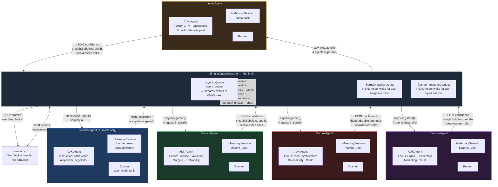

**Key design decisions this diagram illustrates:**
- Each agent has a completely isolated `InMemorySession` — Vincent has no idea what Marcus remembers
- `asyncio.gather()` runs all 4 investor evaluations simultaneously (true parallelism, not sequential)
- The orchestrator never lets agents talk to each other directly — all coordination goes through Python code
- FounderAgent is only invoked in AI mode; REAL mode uses `_founder_response` queue instead
- One event queue serialises all output regardless of which agent produced it

---

## Table of Contents

1. [Application Screen Flow](#1-application-screen-flow)
2. [Authentication Flow](#2-authentication-flow)
3. [Simulation Initialisation Flow](#3-simulation-initialisation-flow)
4. [Model Selection & Fallback Flow](#4-model-selection--fallback-flow)
5. [Pitch Phase Flow](#5-pitch-phase-flow)
6. [Q&A Round Flow (Full Round)](#6-qa-round-flow-full-round)
7. [Parallel Investor Evaluation Flow](#7-parallel-investor-evaluation-flow)
8. [Confidence & Status Update Flow](#8-confidence--status-update-flow)
9. [Exit Speech Generation Flow](#9-exit-speech-generation-flow)
10. [Banter Generation Flow](#10-banter-generation-flow)
11. [Bargaining Phase Flow](#11-bargaining-phase-flow)
12. [Report Generation Flow](#12-report-generation-flow)
13. [Frontend Speech Queue Flow](#13-frontend-speech-queue-flow)
14. [Real Mode Input Unlock/Lock Cycle](#14-real-mode-input-unlocklok-cycle)
15. [WebSocket Connection & Event Protocol](#15-websocket-connection--event-protocol)
16. [Cloud Build & Cloud Run Deployment Flow](#16-cloud-build--cloud-run-deployment-flow)
17. [Full End-to-End Flow](#17-full-end-to-end-flow)

---

## 1. Application Screen Flow

High-level navigation between the three screens.

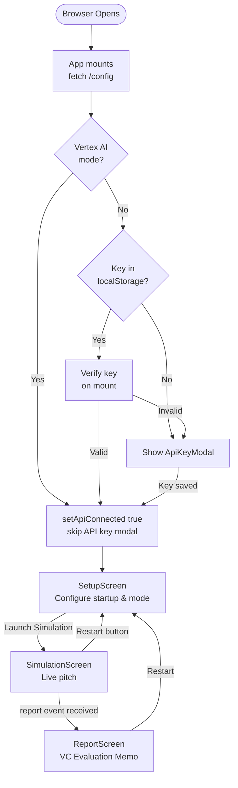

---

## 2. Authentication Flow

How the app decides whether to show the API key modal and how it routes auth to the backend.

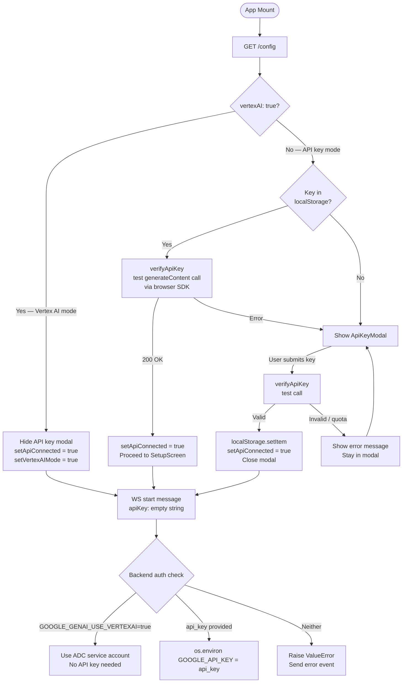

---

## 3. Simulation Initialisation Flow

From WebSocket connect to first pitch event.

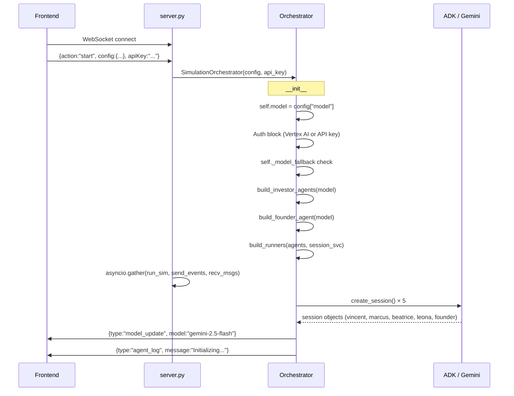

---

## 4. Model Selection & Fallback Flow

How the model choice travels from the UI selector to the actual ADK agent, including Vertex AI fallback.

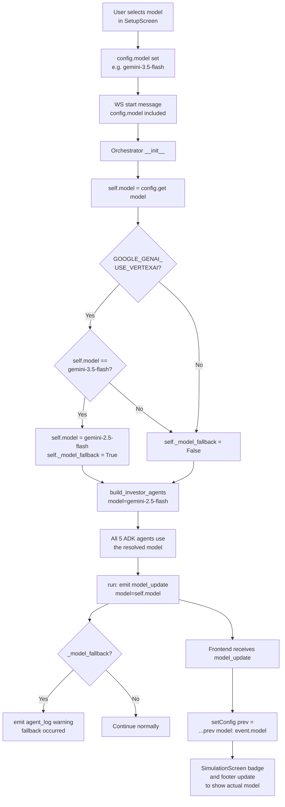

---

## 5. Pitch Phase Flow

The opening pitch — different paths for AI Autopilot and Real Entrepreneur modes.

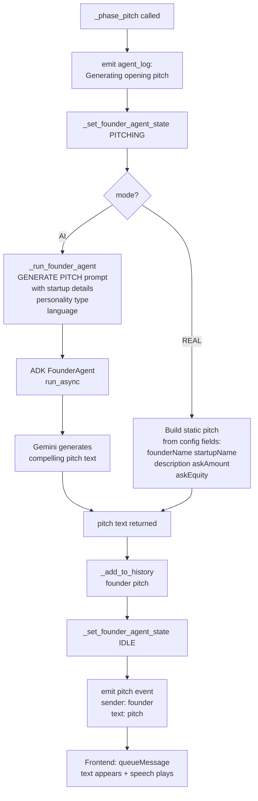

---

## 6. Q&A Round Flow (Full Round)

One complete round: question order is randomised, each investor asks in sequence, all evaluate in parallel.

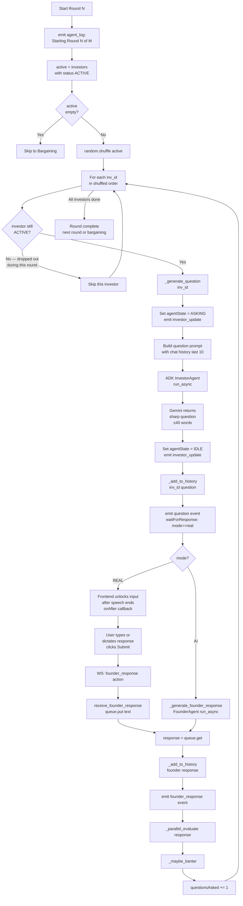

---

## 7. Parallel Investor Evaluation Flow

The core multi-agent feature: all active investors evaluate simultaneously.

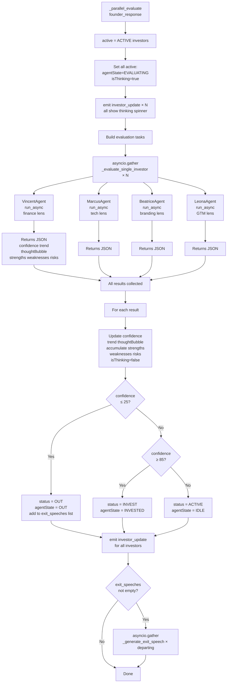

---

## 8. Confidence & Status Update Flow

How a single investor's state transitions across the simulation. INVEST status is only set **after all rounds complete** — investors stay ACTIVE during Q&A no matter how high confidence goes.

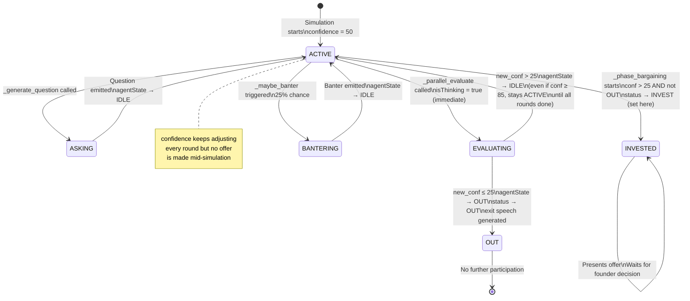

---

## 9. Exit Speech Generation Flow

Dynamic exit speeches grounded in actual conversation history.

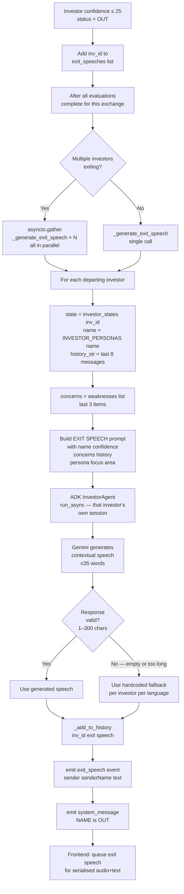

---

## 10. Banter Generation Flow

Spontaneous investor comments with the hallucination guard.

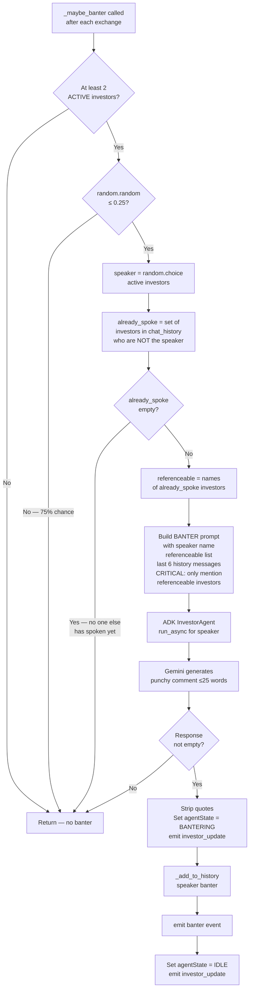

---

## 11. Bargaining Phase Flow

Multi-round negotiation loop — AI mode runs autonomously; REAL mode waits for user each iteration.

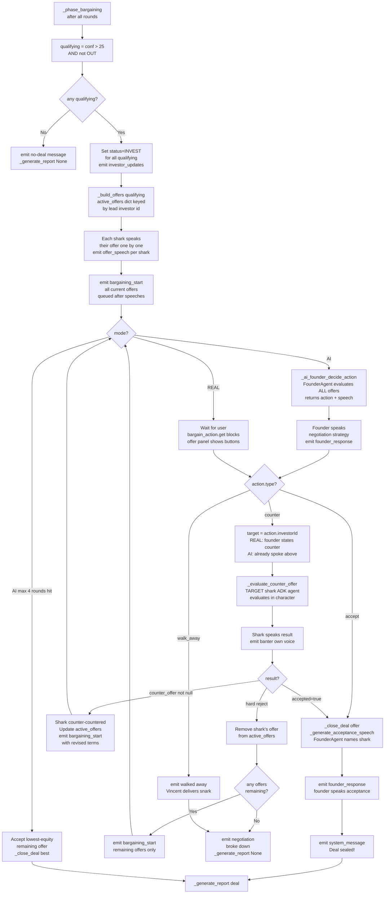

---

## 12. Report Generation Flow

Parallel feedback collection and final memo compilation.

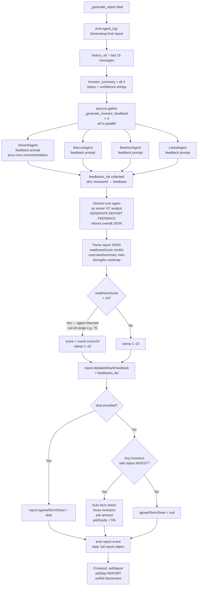

---

## 13. Frontend Speech Queue Flow

How text and audio stay in sync using a serialised Promise chain.

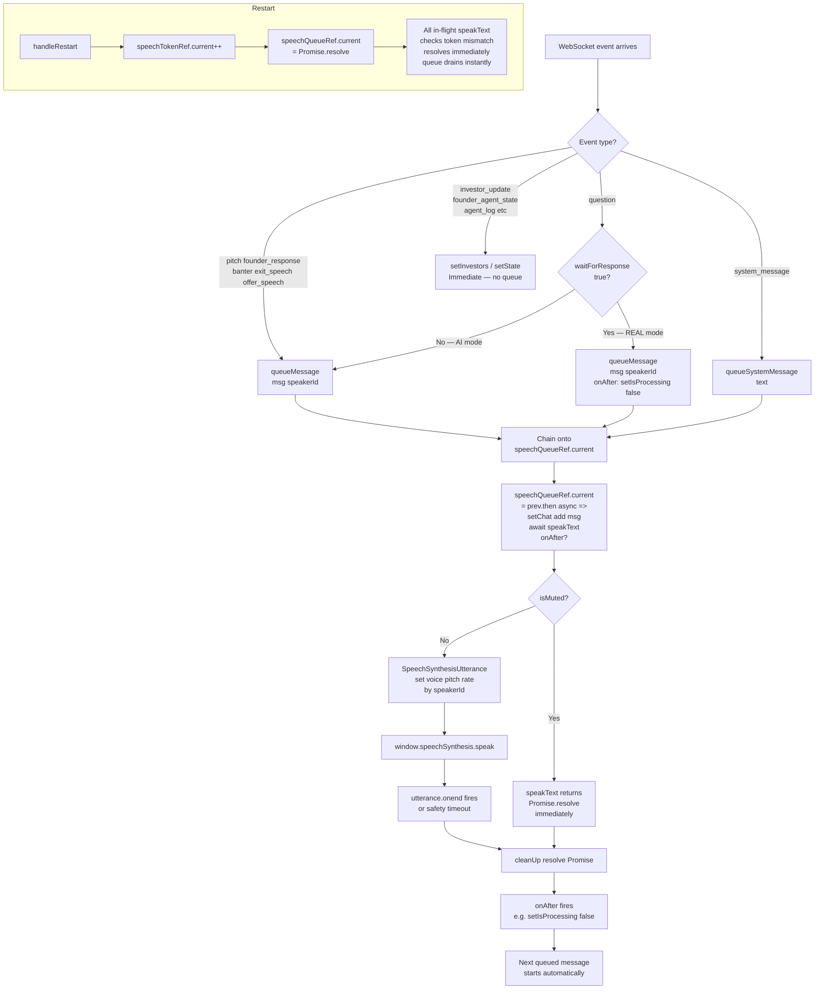

---

## 14. Real Mode Input Unlock/Lock Cycle

The precise sequence that gates founder input in Real Entrepreneur mode.

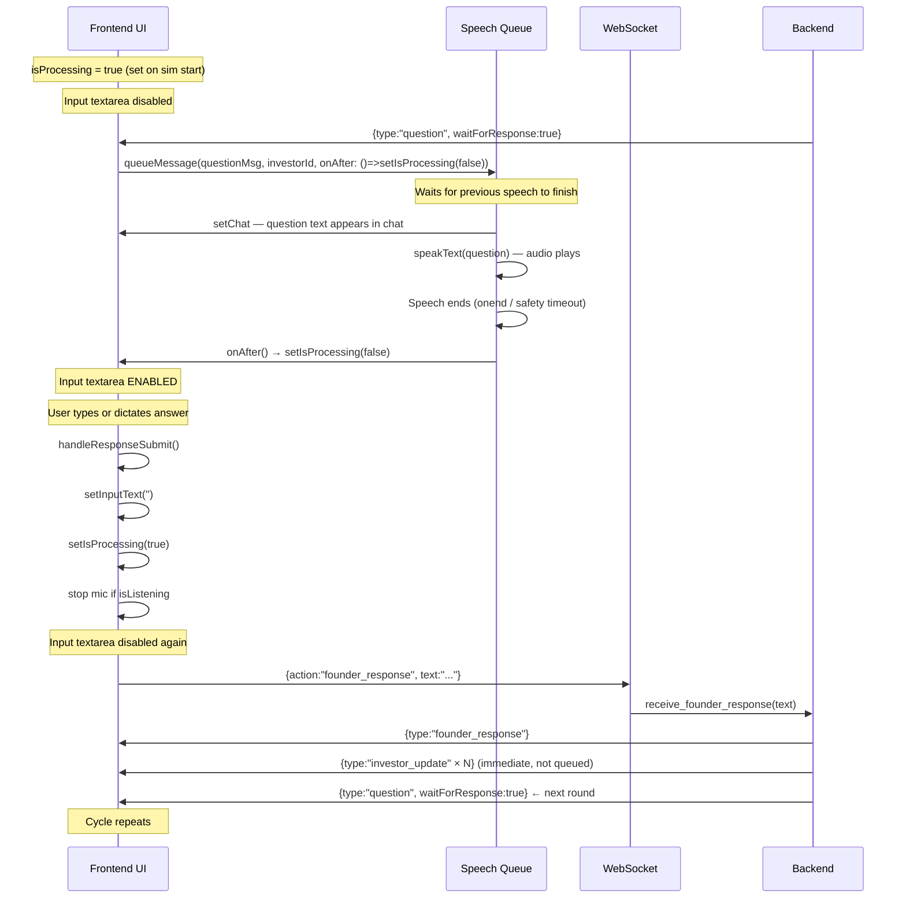

---

## 15. WebSocket Connection & Event Protocol

Complete protocol from connect to disconnect.

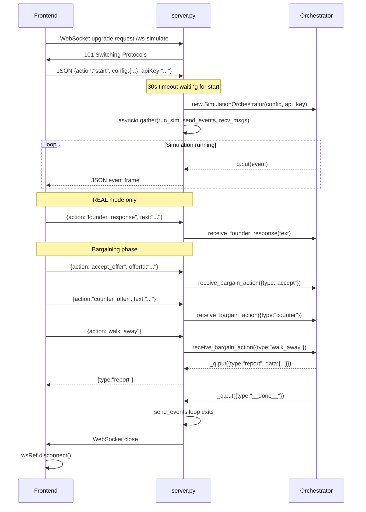

---

## 16. Cloud Build & Cloud Run Deployment Flow

From a git push to a live Cloud Run service.

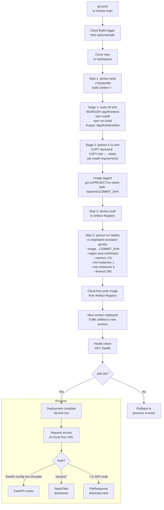

---

## 17. Full End-to-End Flow

The complete journey from page load through simulation completion.

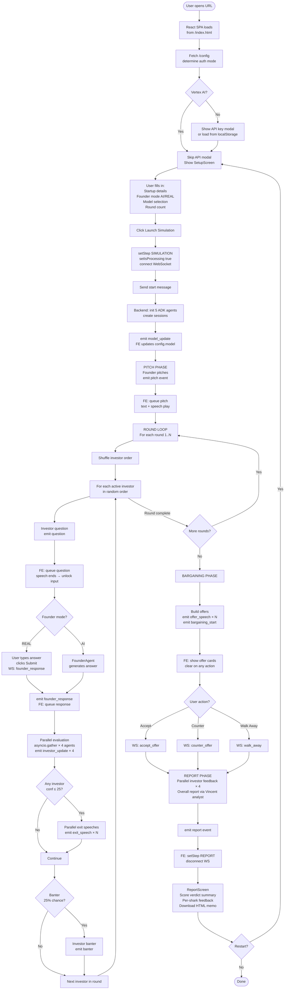

---

> All diagrams render on GitHub. To view locally, paste any diagram block into [mermaid.live](https://mermaid.live).
